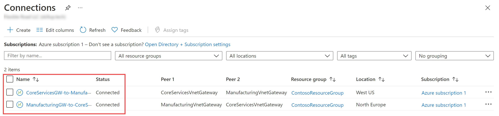

---
lab:
    title: 'M02 - Unit 3 Create and configure a virtual network gateway'
    module: 'Module 02 - Design and implement hybrid networking'
---


# M02-Unit 3 Create and configure a virtual network gateway

In this exercise you will configure a virtual network gateway to connect the Contoso Core Services VNet and Manufacturing VNet. 

In this exercise, you will:

+ Task 1: Create CoreServicesVnet and ManufacturingVnet
+ Task 2: Create CoreServicesVnet Gateway
+ Task 3: Create ManufacturingVnet Gateway
+ Task 4: Create CoreServicesVM
+ Task 5: Create ManufacturingVM
+ Task 6: Connect to the Test VMs using RDP
+ Task 7: Test the connection between the VMs
+ Task 8: CoreServicesVnet to ManufacturingVnet 
+ Task 9: Verify that the connections connect 
+ Task 10: Test the connection between the VMs

>**Note**: An **[interactive lab simulation](https://mslabs.cloudguides.com/guides/AZ-700%20Lab%20Simulation%20-%20Create%20and%20configure%20a%20virtual%20network%20gateway)** is available that allows you to click through this lab at your own pace. You may find slight differences between the interactive simulation and the hosted lab, but the core concepts and ideas being demonstrated are the same.

### Estimated time: 70 minutes (including ~45 minutes deployment waiting time)

## Task 1: Create CoreServicesVnet and ManufacturingVnet

1. In the Azure portal, select the Cloud Shell icon (top right). If necessary, configure the shell.  
    + Select **PowerShell**.
    + Select **No Storage Account required** and your **Subscription**, then select **Apply**.
    + Wait for the terminal to create and a prompt to be displayed. 

1. On the toolbar of the Cloud Shell pane, select the **Manage files** icon, in the drop-down menu, select **Upload** and upload the following files **azuredeploy.json** and **azuredeploy.parameters.json** into the Cloud Shell home directory from the source folder **C:\Allfiles\Exercises\M02**

1. Deploy the following ARM templates to create the virtual network and subnets needed for this exercise:

   ```powershell
   $RGName = "ContosoResourceGroup"
   #create resource group if it doesnt exist
   New-AzResourceGroup -Name $RGName -Location "eastus"
   New-AzResourceGroupDeployment -ResourceGroupName $RGName -TemplateFile azuredeploy.json -TemplateParameterFile azuredeploy.parameters.json
   ```


## Task 2: Create CoreServicesVnet Gateway

1. In **Search resources, services, and docs (G+/)**, enter **Virtual network gateway**, and then select **Virtual network gateways** from the results.
   

1. In Virtual network gateways, select **+ Create**.

1. Use the information in the following table to create the virtual network gateway:

   | **Tab**         | **Section**       | **Option**                                  | **Value**                    |
   | --------------- | ----------------- | ------------------------------------------- | ---------------------------- |
   | Basics          | Project Details   | Subscription                                | No changes required          |
   |                 | Instance Details  | Name                                        | CoreServicesVnetGateway      |
   |                 |                   | Region                                      | East US                      |
   |                 |                   | Gateway type                                | VPN                          |
   |                 |                   | SKU                                         | VpnGw1                       |
   |                 |                   | Generation                                  | Generation1                  |
   |                 |                   | Virtual network                             | CoreServicesVnet             |
   |                 |                   | Subnet                                      | GatewaySubnet (10.20.0.0/27) |
   |                 | Public IP address | Public IP address                           | Create new                   |
   |                 |                   | Public IP address name                      | CoreServicesVnetGateway-ip   |
   |                 |                   | Enable active-active mode                   | Disabled                     |
   |                 |                   | Configure BGP                               | Disabled                     |
   | Select **Review + create** |                   | Review your settings and select **Create**. |                              |

   > **Note:** 
   > 
   >When the '**Deployment is in progress**' Go straight to the **next task: Task 3** It can take up to 45 minutes to create a virtual network gateway. 

## Task 3: Create ManufacturingVnet Gateway

1. In **Search resources, services, and docs (G+/)**, enter **Virtual network gateway**, and then select **Virtual network gateways** from the results.

1. In Virtual network gateways, select **+ Create**.

1. Use the information in the following table to create the virtual network gateway:

   | **Tab**         | **Section**       | **Option**                                  | **Value**                    |
   | --------------- | ----------------- | ------------------------------------------- | ---------------------------- |
   | Basics          | Project Details   | Subscription                                | No changes required          |
   |                 | Instance Details  | Name                                        | ManufacturingVnetGateway     |
   |                 |                   | Region                                      | North Europe                  |
   |                 |                   | Gateway type                                | VPN                          |
   |                 |                   | SKU                                         | VpnGw1                       |
   |                 |                   | Generation                                  | Generation1                  |
   |                 |                   | Virtual network                             | ManufacturingVnet            |
   |                 |                   | Subnet                                      | GatewaySubnet (10.30.0.0/27) |
   |                 | Public IP address | Public IP address                           | Create new                   |
   |                 |                   | Public IP address name                      | ManufacturingVnetGateway-ip  |
   |                 |                   | Enable active-active mode                   | Disabled                     |
   |                 |                   | Configure BGP                               | Disabled                     |
   | Select **Review + create** |                   | Review your settings and select **Create**. |                              |
   
   > **Note:**
   >
   >When the '**Deployment is in progress**' Go straight to the **next task: Task 4** It can take up to 45 minutes to create a virtual network gateway. 


## Task 4: Create CoreServicesVM

1. On the Azure portal, open the **PowerShell** session within the **Cloud Shell** pane.

1. On the toolbar of the Cloud Shell pane, select the **Manage files** icon, in the drop-down menu, select **Upload** and upload the following files **CoreServicesVMazuredeploy.json** and **CoreServicesVMazuredeploy.parameters.json** into the Cloud Shell home directory one by one from the source folder **F:\Allfiles\Exercises\M02**.

1. Deploy the following ARM templates to create the VMs needed for this exercise:

   >**Note**: You will be prompted to provide an Admin password.  Use **Pa55w.rd1234abc**

   ```powershell
   $RGName = "ContosoResourceGroup"
   
   New-AzResourceGroupDeployment -ResourceGroupName $RGName -TemplateFile CoreServicesVMazuredeploy.json -TemplateParameterFile CoreServicesVMazuredeploy.parameters.json
   ```
  
1. When the deployment is complete, go to the Azure portal home page, and then select **Virtual Machines**.

1. Verify that the virtual machine has been created.

## Task 5: Create ManufacturingVM

1. On the Azure portal, open the **PowerShell** session within the **Cloud Shell** pane.

1. 1. On the toolbar of the Cloud Shell pane, select the **Manage files** icon, in the drop-down menu, select **Upload** and upload the following files **ManufacturingVMazuredeploy.json** and **ManufacturingVMazuredeploy.parameters.json** into the Cloud Shell home directory from the source folder **C:\Allfiles\M02**.

1. Deploy the following ARM templates to create the VMs needed for this exercise:

   >**Note**: You will be prompted to provide an Admin password.  Use **Pa55w.rd1234abc**

   ```powershell
   $RGName = "ContosoResourceGroup"
   
   New-AzResourceGroupDeployment -ResourceGroupName $RGName -TemplateFile ManufacturingVMazuredeploy.json -TemplateParameterFile ManufacturingVMazuredeploy.parameters.json
   ```
  
  
1. When the deployment is complete, go to the Azure portal home page, and then select **Virtual Machines**.

1. Verify that the virtual machine has been created.


## Task 6: Connect to the Test VMs using RDP

1. On the Azure Portal home page, select **Virtual Machines**.

1. Select **ManufacturingVM**.

1. On **ManufacturingVM**, select **Connect &gt; Connect**.

1. On **ManufacturingVM \| Connect**, select **Download RDP file**.

1. Select keep if prompted.

1. Connect to ManufacturingTestVM using the RDP file, and the username **TestUser** and the password **Pa55w.rd1234abc**. After connecting, minimize the RDP session.

1. On the Azure Portal home page, select **Virtual Machines**.

1. Select **CoreServicesVM**.

1. On **CoreServicesVM**, select **Connect &gt; Connect**.

1. On **CoreServicesVM \| Connect**, select **Download RDP file**.

1. Select keep if prompted.

1. Connect to CoreServicesTestVM using the RDP file, and the username **TestUser** and the password **Pa55w.rd1234abc**.

1. On both VMs, in **Networks**, select **Yes**.

1. On **CoreServicesTestVM**, open a **PowerShell prompt**.

1. Use the following command to note the **IPv4 address** of the machine:

   ```Powershell
   ipconfig
   ```


## Task 7: Test the connection between the VMs

1. On the **ManufacturingVM**, open a **PowerShell prompt**.

1. Use the following command to verify that there is no connection to CoreServicesVM on CoreServicesVnet. Be sure to use the IPv4 address for CoreServicesVM.

   ```Powershell
   Test-NetConnection 10.20.20.4 -port 3389
   ```

1. The test connection should fail, and you will see a result similar to the following:

   


## Task 8: Connect CoreServicesVnet and ManufacturingVnet together.

   > **Note:**
   >
   >  **You will not be able to complete this configuration until the virtual network gateways are fully deployed.**


1. In **Search resources, services, and docs (G+/)**, enter **Virtual network gateway**, and then select **Virtual network gateways** from the results.
   
1. Under **Hybrid Connectivity** \| **ExpressRoute gateways**

1. Select VPN gateways from the **VPN gateway** section.
   
1. In Virtual network gateways, select **CoreServicesVnetGateway**.

1. In the setting section select connections

1. Select **+ Add**.

1. Use the information in the following table to create the connection:

   | **Option**                     | **Value**                         |
   | ------------------------------ | --------------------------------- |
   | Subscription                   | Your subscription                 |
   | Connection type                | VNet-to-VNet                      |
   | Establish bidirectional connectivity | Enable                       |
   | First connection name          | CoreServicesGW-to-ManufacturingGW |
   | Second connection name     |   ManufacturingGW-to-CoreServicesGW  
   | Location                       | East US                           |

1. Select next, on the setting tabs use the following values:

   | **Option**    | **Value**    |
   |--------------------------------|-----------------------------------|
   | First virtual network gateway  | CoreServicesVnetGateway           |
   | Second virtual network gateway | ManufacturingVnetGateway          |
   | Shared key (PSK)               | abc123                            |
    | IKE Protocol                   | IKEv2                             |
   | Use Azure Private IP Address   | Not selected                      |
   | Enable BGP                     | Not selected                      |
   | Subscription                   | No changes required               |
   | Resource group                 | No changes required               |

1. To create the connection, select **Review and Create** and then **Create**.
   


## Task 9: Verify that the connections connect 

1. In **Search resources, services, and docs (G+/)**, enter **connections**, and then select **connections** from the results.

1. Wait until the status of both connections is **Connected**. You may need to refresh your screen. 

>**Note:** This could take a couple of minutes.

   

 

## Task 10: Test the connection between the VMs

1. On the **ManufacturingVM**, open PowerShell.

1. Use the following command to verify that there is now a connection to CoreServicesVM on CoreServicesVnet. Be sure to use the IPv4 address for CoreServicesVM.

   ```Powershell
   Test-NetConnection 10.20.20.4 -port 3389
   ```

1. The test connection should succeed, and you will see a result similar to the following:

   

1. Close the Remote Desktop connection windows.

Congratulations! You have configured a VNet-to-VNet connection by using a virtual network gateway.
