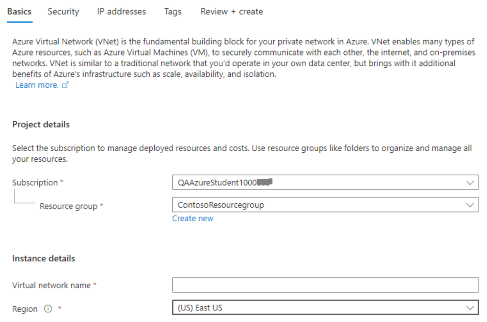

---
lab:
    title: 'M04 - Unit 4 Create and configure an Azure load balancer'
    module: 'Module 04 - Load balancing non-HTTP(S) traffic in Azure'
---


# M04-Unit 4 Create and configure an Azure load balancer

In this exercise, you will create an internal load balancer for the fictional Contoso Ltd organization. 

#### Estimated time: 60 minutes (includes ~45 minutes deployment waiting time)

The steps to create an internal load balancer, are very similar to those you have already learned about in this module, to create a public load balancer. The key difference is that with a public load balancer the front end is accessed via a public IP address, and you test connectivity from a host which is located outside your virtual network; whereas, with an internal load balancer, the front end is a private IP address inside your virtual network, and you test connectivity from a host inside the same network.

The diagram below illustrates the environment you will be deploying in this exercise.


 
In this exercise, you will:

+ Task 1: Create the virtual network
+ Task 2: Create backend servers
+ Task 3: Create the load balancer
+ Task 4: Create load balancer resources
+ Task 5: Test the load balancer

## Task 1: Create the virtual network

In this section, you will create a virtual network and a subnet.
   
1. Log in to the Azure portal.

1. On any Azure Portal page, in **Search resources, services and docs**, enter virtual network, and then select **Virtual networks** from the results.

1. On the Virtual networks page, select **+Create**.

>**Important Note:** 
>>If the CREATE VIRTUAL NETWORK - TAB menu order is:     
*"Basics* | **Security** | **IP Addressess** | *Tags* | *Review + Create*". Use **Option 1 instructions**.

>>If the CREATE VIRTUAL NETWORK - TAB menu order is:   
*"Basics* | **IP Addressess** | **Security** | *Tags* | *Review + Create*". Scroll down and use **Option 2 instructions**.

#### **Option 1 instructions**

1. On the Create virtual networks blade, on the **Basics** tab, use the information in the following table to create the VNet:

   | **Setting**    | **Value**                                  |
   | -------------- | ------------------------------------------ |
   | Subscription   | Select your subscription                   |
   | Resource group | Select **Create  new**  Name: **IntLB-RG** |
   | Name           | **IntLB-VNet**                             |
   | Region         | **(US) East US**                           |

1. Click **Next**.

1. On the Create virtual networks blade, on the **Security** tab select the  **Enable Azure Bastion** tickbox, then enter the information from the table below.

    | **Setting**                       | **Value**                                     |
    | --------------------------------- | --------------------------------------------- |
    | Azure Bastion host name                      | **IntLB-Vnet-Bastion**                             |
    | Azure Bastion Public IP address                 | Select: **Create a public IP address** - Accept the default name and click **OK**  |

1. Click **Next**.

1. On the Create virtual networks blade, on the **IP addresses** tab: In the **existing Address space section**,
   under **Subnets**, select the **default** link.

1. On the **Edit subnet blade**, under **Subnet details**: Change the Name to **MyBackendSubnet**. 

1. Click **Save**

1. In the Address space section. Click **Add a subnet**   

1. Create a subnet with the following **Subnet settings** (leave other settings with their default values):

    | Setting | Value |
    | --- | --- |
    | Subnet template | **Default** |
    | Name | **MyFrontendSubnet**
    | Starting address | **10.0.2.0** |
    | Subnet size | **/24 (32 addresses)** |

1. Click **Add**

1. Click **Review and Create**. Let validation occur, and click **Create** again to submit your deployment.

#### **Option 2 instructions**

1. On the Azure portal home page, navigate to the Global Search bar and search **Virtual Networks** and select virtual networks under services.  

1. Select **Create** on the Virtual networks page.  

1. On the **Basics** tab, use the information in the table below to create the virtual network.

   | **Setting**    | **Value**                                  |
   | -------------- | ------------------------------------------ |
   | Subscription   | Select your subscription                   |
   | Resource group | Select **Create  new**  Name: **IntLB-RG** |
   | Name           | **IntLB-VNet**                             |
   | Region         | **(US) East US**                           |


1. Select **Next : IP Addresses**.   

1. On the **IP Addresses** tab, select **+ Add subnet**.

1. In the **Add subnet** pane, provide a subnet name of **myBackendSubnet**, and a subnet address range of **10.0.0.0/24**.

1. Select **Add**.

1. Select **Add subnet**, provide a subnet name of **myFrontEndSubnet**, and a subnet address range of **10.0.2.0/24**. Select **Add**

1. Select **Next : Security**.

1. Under **BastionHost** select **Enable**, then enter the information from the table below.

    | **Setting**                       | **Value**                                     |
    | --------------------------------- | --------------------------------------------- |
    | Bastion name                      | **myBastionHost**                             |
    | AzureBastionSubnet address  space | **10.0.1.0/24**                               |
    | Public IP address                 | Select **Create  new**  Name: **myBastionIP** |


1. Select **Review + create**.

1. Select **Create**.

## Task 2: Create backend servers

In this section, you will create three VMs, that will be in the same availability set, for the backend pool of the load balancer, add the VMs to the backend pool, and then install IIS on the three VMs to test the load balancer.

1. On the Azure portal, open the **PowerShell** session within the **Cloud Shell** pane.

2. On the toolbar of the Cloud Shell pane, select the **Upload/Download files** icon, in the drop-down menu, select **Upload** and upload the following files ***azuredeploy.json***, ***azuredeploy.parameters.vm1.json***, ***azuredeploy.parameters.vm2.json*** and ***azuredeploy.parameters.vm3.json*** into the Cloud Shell home directory **one by one**.

3. Deploy the following ARM templates to create the VMs needed for this exercise:

>**Important Note:** 
When prompted for the User Password: For Example Use: **Pa55w.rd1234** and add your initials to the end to make it unique. (i.e: ***Pa55w.rd1234AB***) If you use any other complex password, make sure that you take note of it, it will be required in later steps,

   ```powershell
   $RGName = "IntLB-RG"
   
   New-AzResourceGroupDeployment -ResourceGroupName $RGName -TemplateFile azuredeploy.json -TemplateParameterFile azuredeploy.parameters.vm1.json
   New-AzResourceGroupDeployment -ResourceGroupName $RGName -TemplateFile azuredeploy.json -TemplateParameterFile azuredeploy.parameters.vm2.json
   New-AzResourceGroupDeployment -ResourceGroupName $RGName -TemplateFile azuredeploy.json -TemplateParameterFile azuredeploy.parameters.vm3.json
   Write-Host "Deployment complete"
   ```

>**Note** It may take 10-20 mins to create these three VMs. 
>**Wait for the deployment to finish before moving to the next task**

## Task 3: Create the load balancer

In this section, you will create an internal Standard SKU load balancer. The reason we are creating a Standard SKU load balancer here in the exercise, instead of a Basic SKU load balance, is for later exercises that require a Standard SKU version of the load balancer.

1. On the Azure portal home page, select **Create a resource**.

1. On the search box at the top of the page, type **Load**, then select **Load Balancers** from the ***Services list***.

1. In the ***Load Balancing*** Blade, make sure that ***Load Balancer*** is selected.

1. Select **+ Create**.

1. On the **Basics** tab, use the information in the table below to create the load balancer.

   | **Setting**           | **Value**                |
   | --------------------- | ------------------------ |
   | Subscription          | Select your subscription |
   | Resource group        | **IntLB-RG**             |
   | Name                  | **myIntLoadBalancer**    |
   | Region                | **(US) East US**         |
   | SKU                   | **Standard**             |
   | Type                  | **Internal**             |
   | Tier                  | **Regional**             |
   
1. Select **Next: Frontend IP configurations**.

1. Select **+ Add a frontend IP configuration**

1. On the **Add frontend IP address** blade, enter the information from the table below.
 
   | **Setting**     | **Value**                |
   | --------------- | ------------------------ |
   | Name            | **LoadBalancerFrontEnd** |
   | Virtual network | **IntLB-VNet**           |
   | Subnet          | **myFrontEndSubnet**     |
   | Assignment      | **Dynamic**              |
   | Availability zone | **No Zone**             |  

1. Click **Add**

1. Select **Next : Backend pools**.

1. Select **+ Add a backend pool**
 
1. On the **Add backend pool** blade, enter the information from the table below.

   | **Setting**     | **Value**            |
   | --------------- | -------------------- |
   | Name            | **myBackendPool**    |
   | Virtual network | **IntLB-VNet**       |
   | Backend Pool Configuration | **NIC**       |


1. Under **IP Configurations**, select **+ Add**.

1. On the **Add IP configurations to backend pool** blade.

1. Select the checkboxes for all 3 VMs (**myVM1**, **myVM2**, and **myVM3**), then select **Add**.

1. Back on the **Add backend pool** blade: Select **Save**

1. On the **Create load balancer** blade: Select **Next : inbound rules**

1. On the **Inbound rules** tab, under **Load balancing rule**: Select **+ Add a load balancing rule**

1. On the **Add load balancing rule** page, enter the information from the table below.

   | **Setting**            | **Value**                |
   | ---------------------- | ------------------------ |
   | Name                   | **myHTTPRule**           |
   | IP Version             | **IPv4**                 |
   | Frontend IP address    | Select **LoadBalancerFrontEnd** from drop-down list |
   | Backend pool           | Select **myBackendPool** from drop-down list        |
   | High Avaialability Ports  | **Unchecked**                   |
   | Protocol               | **TCP**                  |
   | Port                   | **80**                   |
   | Backend port           | **80**                   |
   | Health probe           | Select: **Create new**     |

1. On the **Add health probe** pop-up blade: Enter the information in the table below.

   | **Setting**         | **Value**         |
   | ------------------- | ----------------- |
   | Name                | **myHealthProbe** |
   | Protocol            | **TCP**          |
   | Port                | **80**            |
   | Path                | **/**             |
   | Interval            | **5**            |

1. Select **OK**

1. Back on the **Add load balancing rule** blade: click **Add**

1. Back on the **Create load balancer** blade: click **Review + create**

1. Wait for validation to complete.

1. Click **Create**

1. Wait for deployment to complete. 


## Task 5: Test the load balancer

In this section, you will create a test VM, and then test the load balancer.

### Create test VM

1. On the Azure portal home page, select **Create a resource**, then **virtual**, then select **Virtual machine** (if this resource type is not listed on the page, use the search box at the top of the page to search for it and select it).

1. On the **Create a virtual machine** page, on the **Basics** tab, use the information in the table below to create the first VM.

   | **Setting**          | **Value**                                    |
   | -------------------- | -------------------------------------------- |
   | Subscription         | Select your subscription                     |
   | Resource group       | **IntLB-RG**                                 |
   | Virtual machine name | **myTestVM**                                 |
   | Region               | **(US) East US**                             |
   | Availability options | **No infrastructure redundancy required**    |
   | Image                | **Windows Server 2019 Datacenter - Gen 2**   |
   | Size                 | **Standard_DS2_v3 - 2 vcpu, 8 GiB memory** |
   | Username             | **TestUser**                                 |
   | Password             | **Pa55w.rd1234??** Where (??) is your initails to make the password Unique                         |
   | Confirm password     | **Pa55w.rd1234??**   |


1. Select **Next : Disks**, then select **Next : Networking**. 

1. On the **Networking** tab, use the information in the table below to configure networking settings. Leave all other settings at their default settings.

   | **Setting**                                                  | **Value**                     |
   | ------------------------------------------------------------ | ----------------------------- |
   | Virtual network                                              | **IntLB-VNet**                |
   | Subnet                                                       | **myBackendSubnet**           |
   | Public IP                                                    | Change to **None**            |


1. Select **Review + create**.

1. Select **Create**.

1. Wait for this last VM to be deployed before moving forward with the next task.

### Connect to the test VM to test the load balancer

1. On the Azure portal home page, select **All resources**, then select on **myIntLoadBalancer** from the resources list.

1. On the **Overview** page, make a note of the **Private IP address**, or copy it to the clipboard. Note: you may need to select **See more** in order to see the **Private IP address** field.

1. Select **Home**, then on the Azure portal home page, select **All resources**, then select on the **myTestVM** virtual machine that you just created.

1. On the **Overview** page, select **Connect**, then **Bastion**.

1. Select **Use Bastion**.

1. In the **Username** box, type **TestUser** and in the **Password** box, type **TestPa$$w0rd!**, then select **Connect**. If popup blocker is preventing the new window, allow popup blocker and **Connect** again.

1. The **myTestVM** window will open in another browser tab.

1. If a **Networks** pane appears, select **Yes**.

1. Select the **Internet Explorer** icon in the task bar to open the web browser.

1. Select **OK** on the **Set up Internet Explorer 11** dialog box.

1. Enter (or paste) the **Private IP address** (e.g. 10.0.0.4) from the previous step into the address bar of the browser and press Enter.

1. The default web home page of the IIS Web server is displayed in the browser window. One of the three virtual machines in the backend pool will respond.
    

## Clean up resources

   >**Note**: Remember to remove any newly created Azure resources that you no longer use. Removing unused resources ensures you will not see unexpected charges.

1. On the Azure portal, open the **PowerShell** session within the **Cloud Shell** pane.

1. Delete all resource groups you created throughout the labs of this module by running the following command:

   ```powershell
   Remove-AzResourceGroup -Name 'IntLB-RG' -Force -AsJob
   ```

    >**Note**: The command executes asynchronously (as determined by the -AsJob parameter), so while you will be able to run another PowerShell command immediately afterwards within the same PowerShell session, it will take a few minutes before the resource groups are actually removed.
