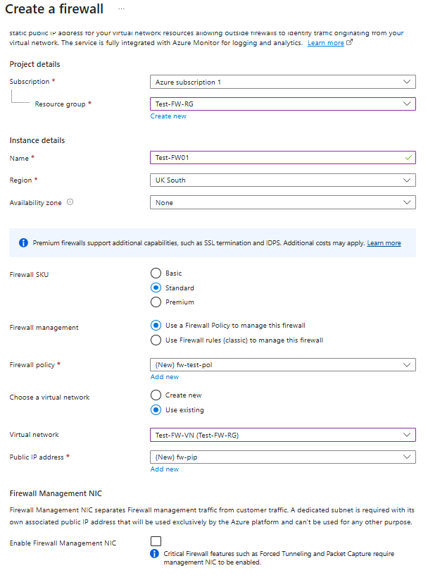
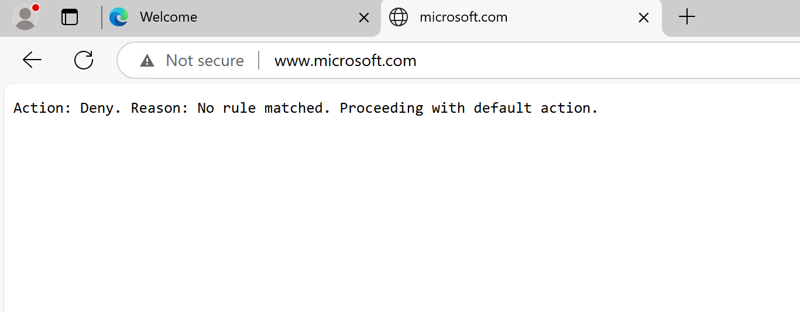

---
Exercise:
    title: 'M06 - Unit 7 Deploy and configure Azure Firewall using the Azure portal'
    module: 'Module 06 - Design and implement network security '
---

# M06-Unit 7 Deploy and configure Azure Firewall using the Azure portal

Being part of the Network Security team at Contoso, your next task is to create firewall rules to allow/deny access to certain websites. The following steps walk you through creating a resource group, a virtual network and subnets, and a virtual machine as environment preparation tasks, and then deploying a firewall and firewall policy, configuring default routes and application, network and DNAT rules, and finally testing the firewall.

In this exercise, you will:

+ Task 1: Create a resource group
+ Task 2: Create a virtual network and subnets
+ Task 3: Create a virtual machine
+ Task 4: Deploy the firewall and firewall policy
+ Task 5: Create a default route
+ Task 6: Configure an application rule
+ Task 7: Configure a network rule
+ Task 8: Configure a Destination NAT (DNAT) rule
+ Task 9: Change the primary and secondary DNS address for the server's network interface
+ Task 10: Test the firewall
+ Task 11: Clean up resources


#### Estimated time: 60 minutes

## Task 1: Create a resource group

In this task, you will create a new resource group.

1. Log in to your Azure account.

1. On the Azure portal home page, select **Resource groups**.

1. Select **Create**. 

1. On the **Basics** tab, in **Resource group**, enter **Test-FW-RG**.

1. On the **Region**, select **(Europe) UK South**.

   

1. Select **Review + create**.

1. Select **Create**.

 

## Task 2: Create a virtual network and subnets

In this task, you will create a single virtual network with two subnets.

1. On the Azure portal home page, in the search box type: **virtual network** and select **virtual network** when it appears.

1. Select **Create**

>**Important Note:** 
>>If the CREATE VIRTUAL NETWORK - TAB menu order is:     
*"Basics* | **Security** | **IP Addressess** | *Tags* | *Review + Create*". Use **Option 1 instructions**.

>>If the CREATE VIRTUAL NETWORK - TAB menu order is:   
*"Basics* | **IP Addressess** | **Security** | *Tags* | *Review + Create*". Scroll down and use **Option 2 instructions**.

#### **Option 1 instructions**

1. On the Create virtual networks pane, on the **Basics** tab, use the information in the following table to create the VNet:

   | **Setting**          | **Value**                        |
   | -------------------- | -------------------------------- |
   | Resource Group       | Select: **Test-FW-RG**            |
   | Virtual Network Name | **Test-FW-VN**                 |
   | Location             | **(Europe) UK South**                          |

1. Click **Next**.

1. On the **Security** blade.Click **Next**.

1. On the **IP addresses** blade: In the **existing Address space section**, check that the address space is set to **10.0.0.0/16**

>**Note:** If the Address space is different, then delete and re-create a **10.0.0.0/16** address space.

1. In the Address space section, under **Subnets**, select **Default**.

1. On the **Edit subnet** blade, use the information in the following table to edit the current Subnet (leave others with their default values):

    | Setting | Value |
    | --- | --- |
    | Subnet template | Select: **Azure Firewall** |
    | Starting address | **10.0.1.0** |

>**Note:** Notice that the Subnet name and Subnet size are automatically selected

1. Click **Save**

1. Back on the **Create virtual network** blade, in the Address space, Select **+ Add a subnet**.

1. Create a subnet with the following **Subnet settings** (leave others with their default values):

    | Setting | Value |
    | --- | --- |
    | Subnet template | **Default** |
    | Name | **Workload-SN**
    | Starting address | **10.0.2.0** |
    | Subnet size | **/24 (256 addresses)** |

1. Click **Add**

1. Click **Review and Create**. Let validation occur, and click **Create** again to submit your deployment.

1. **GO TO Task 3**

#### **Option 2 instructions**

1. On the Azure portal home page, in the search box, type **virtual network** and select **Virtual Network** when it appears.

1. Select **Create**.

1. Select the **Test-FW-RG** resource group you created previously.

1. In the **Name** box, enter **Test-FW-VN**.

   

1. Select **Next: IP Addresses**. Enter IPv4 address space **10.0.0.0/16** if not already there by default. 

1. Under **Subnet name**, select the word **default**.

1. In the **Edit subnet** dialog box, change the name to **AzureFirewallSubnet**.

1. Change the **Subnet address range** to **10.0.1.0/26**.

1. Select **Save**.

1. Select **Add subnet**, to create another subnet, which will host the workload server that you will create shortly.


    
    
1. In the **Edit subnet** dialog box, change the name to **Workload-SN**.

1. Change the **Subnet address range** to **10.0.2.0/24**.

1. Select **Add**.

1. Select **Review + create**.

1. Select **Create**.

 

## Task 3: Create a virtual machine

In this task, you will create the workload virtual machine and place it in the Workload-SN subnet created previously.

1. On the Azure portal, open the **PowerShell** session within the **Cloud Shell** pane.

1. In the toolbar of the Cloud Shell pane, select the **Upload/Download files** icon, in the drop-down menu, select **Upload** and upload the following files **firewall.json** and **firewall.parameters.json** into the Cloud Shell home directory one by one from the source folder **F:\Allfiles\Exercises\M06**.

1. Deploy the following ARM templates to create the VM needed for this exercise:

   ```powershell
   $RGName = "Test-FW-RG"
   
   New-AzResourceGroupDeployment -ResourceGroupName $RGName -TemplateFile firewall.json -TemplateParameterFile firewall.parameters.json
   ```
  
1. When the deployment is complete, Close **Cloud Shell**

1. Go to the Azure portal home page, and then select **Virtual Machines**.

1. Select the Virtual machine **Srv-Work**

1. On the **Overview** page of **Srv-Work**, on the right of the page under **Networking**, take a note of the **Private IP address** for this VM (e.g., **10.0.2.4**).
 

## Task 4: Deploy the firewall and firewall policy

In this task, you will deploy the firewall into the virtual network with a firewall policy configured.

1. On the Azure portal home page, select **Create a resource**, then in the search box, type **firewall** and select **Firewall** when it appears.

1. On the **Firewall** page, select **Create**.

1. On the **Basics** tab, create a firewall using the information in the table below.

   | **Setting**          | **Value**                                                    |
   | -------------------- | ------------------------------------------------------------ |
   | Subscription         | Select your subscription                                     |
   | Resource group       | **Test-FW-RG**                                               |
   | Firewall name        | **Test-FW01**                                                |
   | Region               | **UK South**                                                 |
   | Firewall SKU        | **Standard**                                                 |
   | Firewall management  | **Use a Firewall Policy to manage this firewall**            |
   | Firewall policy      | Select **Add new** |

1. On the **Create a new firewall policy** pop-up, use the information in the table below.
  
   | **Setting**          | **Value**                                                    |
   | -------------------- | ------------------------------------------------------------ |
   | Policy name | **fw-test-pol**
   | Region | **UK South**|
   |Policy tier | **Standard** |

1. Click **OK** 
      
   
   | **Setting**          | **Value**                                                    |
   | -------------------- | ------------------------------------------------------------ |
   | Choose a virtual network | Select: **Use existing**  |
   | Virtual network     | Select **Test-FW-VN** from drop-down list.                           |
   
   | **Setting**          | **Value**                                                    |
   | -------------------- | ------------------------------------------------------------ |
   | Public IP address        | Select **Add new**|
   | Name                     | **fw-pip**        |

1. Click **OK**

   

1. Review all the settings to ensure they match the screenshot below.

   

1. Select **Review + create**.

1. Select **Create** and wait for the firewall deployment to complete.

1. When deployment of the firewall is completed, select **Go to resource**.

1. On the **Overview** page of **Test-FW01**, on the right of the page, take a note of the **Firewall private IP** for this firewall (e.g., **10.0.1.4**).

1. In the menu on the left, under **Settings**, select **Public IP configuration**.

1. Take a note of the address under **IP Address** for the **fw-pip** public IP configuration (e.g., **20.90.136.51**).

 

## Task 5: Create a default route

In this task, on the Workload-SN subnet, you will configure the outbound default route to go through the firewall.

1. On the Azure portal home page, select **Create a resource**, then in the search box, type **route** and select **Route table** when it appears.

1. On the **Route table** page, select **Create**.

1. On the **Basics** tab, create a new route table using the information in the table below.

   | **Setting**              | **Value**                |
   | ------------------------ | ------------------------ |
   | Subscription             | Select your subscription |
   | Resource group           | **Test-FW-RG**           |
   | Region                   | **UK South**           |
   | Name                     | **Firewall-route**       |
   | Propagate gateway routes | **Yes**                  |


1. Select **Review + create**.

1. Select **Create**.

   

1. After deployment completes, select **Go to resource**.

1. On the **Firewall-route** page, under **Settings**, select **Subnets** and then select **Associate**.

1. On **Virtual network**, select **Test-FW-VN**.

1. On **Subnet**, select **Workload-SN**. Make sure that you select only the Workload-SN subnet for this route, otherwise your firewall won't work correctly.

1. Select **OK**.

1. Back on the **Firewall route** blade, under **Settings**, select **Routes** and then select **+ Add**.

1. On **Route name**, enter **fw-dg**.

1. On the **Destination address prefix** : Select **IP Addresses** from the drop-down list.

1. On **Destination IP addresses/CIDR ranges**, enter **0.0.0.0/0**.

1. On **Next hop type**, select **Virtual appliance**.

1. On **Next hop address**, type the private IP address for the firewall that you noted previously (e.g., **10.0.1.4**)

1. Select **Add**.

    

 

## Task 6: Configure an application rule

In this task, you will add an application rule that allows outbound access to www.google.com.

1. On the Azure portal home page, select **All resources**.

1. In the list of resources, select your firewall policy, **fw-test-pol**.

1. Under **Settings**, select **Application Rules**.

1. Select **Add a rule collection**.

1. On the **Add a rule collection** page, create a new application rule using the information in the table below.

   | **Setting**            | **Value**                                 |
   | ---------------------- | ----------------------------------------- |
   | Name                   | **App-Coll01**                            |
   | Rule collection type   | **Application**                           |
   | Priority               | **200**                                   |
   | Rule collection action | **Allow**                                 |
   | Rule collection group  | **DefaultApplicationRuleCollectionGroup** |
   | **Rules Section**      |                                           |
   | Name                   | **Allow-Google**                          |
   | Source type            | **IP Address**                            |
   | Source                 | **10.0.2.0/24**                           |
   | Protocol               | **http,https**                            |
   | Destination type       | **FQDN**                                  |
   | Destination            | **www.google.com**                        |


   

1. Select **Add**.

 > Wait for Update to complete before doing next step.

## Task 7: Configure a network rule

In this task, you will add a network rule that allows outbound access to two IP addresses at port 53 (DNS).

1. On the **fw-test-pol** page, under **Settings**, select **Network Rules**.

1. Select **Add a rule collection**.

1. On the **Add a rule collection** page, create a new network rule using the information in the table below.

   | **Setting**            | **Value**                                                    |
   | ---------------------- | ------------------------------------------------------------ |
   | Name                   | **Net-Coll01**                                               |
   | Rule collection type   | **Network**                                                  |
   | Priority               | **200**                                                      |
   | Rule collection action | **Allow**                                                    |
   | Rule collection group  | **DefaultNetworkRuleCollectionGroup**                        |
   | **Rules Section**      |                                                              |
   | Name                   | **Allow-DNS**                                                |
   | Source type            | **IP Address**                                               |
   | Source                 | **10.0.2.0/24**                                              |
   | Protocol               | **UDP**                                                      |
   | Destination Ports      | **53**                                                       |
   | Destination Type       | **IP Address**                                               |
   | Destination            | **209.244.0.3, 209.244.0.4**<br />These are public DNS servers operated by Century Link |


   ​	

1. Select **Add**.

 > Wait for Update to complete before doing next step.
 

## Task 8: Configure a Destination NAT (DNAT) rule

In this task, you will add a DNAT rule that allows you to connect a remote desktop to the Srv-Work virtual machine through the firewall.

1. On the **fw-test-pol** page, under **Settings**, select **DNAT Rules**.

1. Select **Add a rule collection**.

1. On the **Add a rule collection** page, create a new DNAT rule using the information in the table below.

   | **Setting**           | **Value**                                                    |
   | --------------------- | ------------------------------------------------------------ |
   | Name                  | **rdp**                                                      |
   | Rule collection type  | **DNAT**                                                     |
   | Priority              | **200**                                                      |
   | Rule collection group | **DefaultDnatRuleCollectionGroup**                           |
   | **Rules Section**     |                                                              |
   | Name                  | **rdp-nat**                                                  |
   | Source type           | **IP Address**                                               |
   | Source                | *                                                            |
   | Protocol              | **TCP**                                                      |
   | Destination Ports     | **3389**                                                     |
   | Destination Type      | **IP Address**                                               |
   | Destination           | Enter the firewall public IP address from **fw-pip** that you noted earlier.<br />**e.g. - 20.90.136.51** |
   | Translated address    | Enter the private IP address from **Srv-Work** that you noted earlier.<br />**e.g. - 10.0.2.4** |
   | Translated port       | **3389**                                                     |


​		

1. Select **Add**.

 > Wait for Update to complete before doing next step.
 

## Task 9: Change the primary and secondary DNS address for the server's network interface

For testing purposes in this exercise, in this task, you will configure the Srv-Work server's primary and secondary DNS addresses. However, this is not a general Azure Firewall requirement.

1. On the Azure portal home page, select **Resource groups**.

1. In the list of resource groups, select your resource group, **Test-FW-RG**.

1. In the list of resources in this resource group, select the network interface for the **Srv-Work** virtual machine (e.g., **srv-work350**).

   

1. Under **Settings**, select **DNS servers**.

1. Under **DNS servers**, select **Custom**.

1. Type **209.244.0.3** in the **Add DNS server** text box, and **209.244.0.4** in the next text box.

>These are public DNS servers operated by Century Link that you added to the Firewall Network rule earlier.

1. Select **Save**.

   

1. Restart the **Srv-Work** virtual machine.

 >You must reboot the server for the DNS settings to take effect.


## Task 10: Test the firewall

In this final task, you will test the firewall to verify that the rules are configured correctly and working as expected. This configuration will enable you to connect a remote desktop connection to the Srv-Work virtual machine through the firewall, via the firewall's public IP address.

1. Open **Remote Desktop Connection** on your PC.

1. On the **Computer** box, enter the firewall's public IP address (e.g., **20.90.136.51**) followed by **:3389** (e.g., **20.90.136.51:3389**).

1. On the **Username** box, enter **TestUser**.

1. Select **Connect**.

   

1. On the **Enter your credentials** dialog box, log into the **Srv-Work** server virtual machine, by using the password, **TestPa$$w0rd!**.

1. Select **OK**.

1. Select **Yes** on the certificate message.

1. Open Internet Explorer and browse to **https://www.google.com**.

1. On the **Security Alert** dialog box, select **OK**.

1. Select **Close** on the Internet Explorer security alerts that may pop-up.

1. You should see the Google home page.

    

1. Browse to **https://www.microsoft.com**.

1. You should be blocked by the firewall.

    

 
## Task 11: Clean up resources 

>**Note**: Remember to remove any newly created Azure resources that you no longer use. Removing unused resources ensures you will not see unexpected charges.

1. On the Azure portal, open the **PowerShell** session within the **Cloud Shell** pane.

1. Delete all resource groups you created throughout the labs of this module by running the following command:

   ```powershell
   Remove-AzResourceGroup -Name 'Test-FW-RG' -Force -AsJob
   ```

    >**Note**: The command executes asynchronously (as determined by the -AsJob parameter), so while you will be able to run another PowerShell command immediately afterwards within the same PowerShell session, it will take a few minutes before the resource groups are actually removed.
