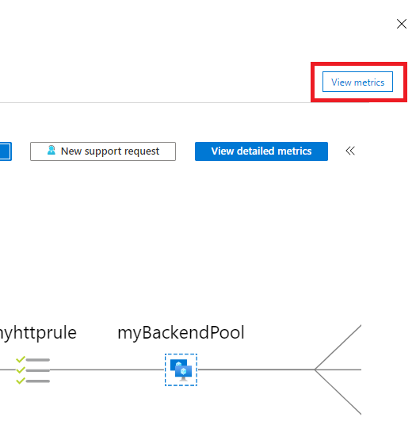

---
lab:
    title: 'M08 - Unit 3 Monitor a load balancer resource using Azure Monitor'
    module: 'Module 08 - Design and implement network monitoring'
---

# M08-Unit 3 Monitor a load balancer resource using Azure Monitor


In this exercise, you will create an internal load balancer for the fictional Contoso Ltd organization. Then you will create a Log Analytics workspace, and use Azure Monitor Insights to view information about your internal load balancer. You will view the Functional Dependency View, then view detailed metrics for the load balancer resource, and view resource health information for the load balancer. Finally, you will configure the load balancer's diagnostic settings to send metrics to the Log Analytics workspace you created. 

The diagram below illustrates the environment you will be deploying in this exercise.


 In this exercise, you will:

+ Task 1: Create the virtual network
+ Task 2: Create backend servers
+ Task 3: Create the load balancer
+ Task 4: Test the load balancer
+ Task 5: Create a Log Analytics Workspace
+ Task 6: Use Functional Dependency View
+ Task 7: View detailed metrics
+ Task 8: View resource health
+ Task 9: Configure diagnostic settings
+ Task 10: Clean up resources


#### Estimated time: 55 minutes

## Task 1: Create the virtual network

In this section, you will create a virtual network and a subnet.
   
1. Log in to the Azure portal.

1. On any Azure Portal page, in **Search resources, services and docs**, enter virtual network, and then select **Virtual networks** from the results.

1. On the Virtual networks page, select **+Create**.

>**Important Note:** 
>>If the CREATE VIRTUAL NETWORK - TAB menu order is:     
*"Basics* | **Security** | **IP Addressess** | *Tags* | *Review + Create*". Use **Option 1 instructions**.

>>If the CREATE VIRTUAL NETWORK - TAB menu order is:   
*"Basics* | **IP Addressess** | **Security** | *Tags* | *Review + Create*". Scroll down and use **Option 2 instructions**.

#### **Option 1 instructions**

1. On the Create virtual networks blade, on the **Basics** tab, use the information in the following table to create the VNet:

   | **Setting**    | **Value**                                  |
   | -------------- | ------------------------------------------ |
   | Subscription   | Select your subscription                   |
   | Resource group | Select **Create  new**  Name: **IntLB-RG** |
   | Name           | **IntLB-VNet**                             |
   | Region         | **(US) East US**                           |

1. Click **Next**.

1. On the Create virtual networks blade, on the **Security** tab select the  **Enable Azure Bastion** tickbox, then enter the information from the table below.

    | **Setting**                       | **Value**                                     |
    | --------------------------------- | --------------------------------------------- |
    | Azure Bastion host name                      | **IntLB-Vnet-Bastion**                             |
    | Azure Bastion Public IP address                 | Leave the default setting to create a **New** Ip Address |

1. Click **Next**.

1. On the Create virtual networks blade, on the **IP addresses** tab: In the **existing Address space section**,
   under **Subnets**, select the **default** link.

1. On the **Edit subnet blade**, under **Subnet details**: Change the Name to **MyBackendSubnet**. 

1. Click **Save**

1. In the warning box: ***'Azure Bastion requires a subnet named 'AzureBastionSubnet'***

1. Click the link. **Add Azure Bastion subnet.**

1. Click **Review and Create**. Let validation occur, and click **Create** again to submit your deployment.

>Wait for deployment to complete.

#### **Option 2 instructions**

1. On the Azure portal home page, navigate to the Global Search bar and search **Virtual Networks** and select virtual networks under services.  

1. Select **Create** on the Virtual networks page.  

1. On the **Basics** tab, use the information in the table below to create the virtual network.

   | **Setting**    | **Value**                                  |
   | -------------- | ------------------------------------------ |
   | Subscription   | Select your subscription                   |
   | Resource group | Select **Create  new**  Name: **IntLB-RG** |
   | Name           | **IntLB-VNet**                             |
   | Region         | **(US) East US**                           |


1. Select **Next : IP Addresses**.   

1. On the **IP Addresses** tab, select **+ Add subnet**.

1. In the **Add subnet** pane, provide a subnet name of **myBackendSubnet**, and a subnet address range of **10.0.0.0/24**.

1. Select **Add**.

1. Select **Add subnet**, provide a subnet name of **myFrontEndSubnet**, and a subnet address range of **10.0.2.0/24**. Select **Add**

1. Select **Next : Security**.

1. Under **BastionHost** select **Enable**, then enter the information from the table below.

    | **Setting**                       | **Value**                                     |
    | --------------------------------- | --------------------------------------------- |
    | Bastion name                      | **myBastionHost**                             |
    | AzureBastionSubnet address  space | **10.0.1.0/24**                               |
    | Public IP address                 | Select **Create  new**  Name: **myBastionIP** |


1. Select **Review + create**.

1. Select **Create**.

>Wait for deployment to complete.

## Task 2: Create backend servers

In this section, you will create three VMs, that will be in the same availability set, for the backend pool of the load balancer, add the VMs to the backend pool, and then install IIS on the three VMs to test the load balancer.

1. On the Azure portal, open the **PowerShell** session within the **Cloud Shell** pane.

2. On the toolbar of the Cloud Shell pane, select the **Upload/Download files** icon, in the drop-down menu, select **Upload** and upload the following files azuredeploy.json, azuredeploy.parameters.vm1.json, azuredeploy.parameters.vm2.json and azuredeploy.parameters.vm3.json into the Cloud Shell home directory one by one from the source folder M08.

3. Deploy the following ARM templates to create the VMs needed for this exercise:

   ```powershell
   $RGName = "IntLB-RG"
   
   New-AzResourceGroupDeployment -ResourceGroupName $RGName -TemplateFile azuredeploy.json -TemplateParameterFile azuredeploy.parameters.vm1.json
   New-AzResourceGroupDeployment -ResourceGroupName $RGName -TemplateFile azuredeploy.json -TemplateParameterFile azuredeploy.parameters.vm2.json
   New-AzResourceGroupDeployment -ResourceGroupName $RGName -TemplateFile azuredeploy.json -TemplateParameterFile azuredeploy.parameters.vm3.json
   Write-Host "Deployment complete"
   ```

>**Note** It may take 10-20 mins to create these three VMs. 
>**Wait for the deployment to finish before moving to the next task**

## Task 3: Create the load balancer

1. On the Azure portal home page, select **Create a resource**.

1. On the search box at the top of the page, type **Load Balancer**, then press **Enter** (**Note:** do not select one from the list).

1. On the results page, locate and select **Load Balancer** (the one that says 'Microsoft' and 'Azure Service' under the name).

1. Select **Create**.

1. On the **Basics** tab, use the information in the table below to create the load balancer.

   | **Setting**           | **Value**                |
   | --------------------- | ------------------------ |
   | Subscription          | Select your subscription |
   | Resource group        | **IntLB-RG**             |
   | Name                  | **myIntLoadBalancer**    |
   | Region                | **(US) West US**         |
   | SKU                   | **Standard**             |
   | Type                  | **Internal**             |
   | Tier                  | **Regional**             |

1. Select **Next: Frontend IP configurations**.

1. Select **+ Add a frontend IP configuration**

1. On the **Add frontend IP address** blade, enter the information from the table below.
 
   | **Setting**     | **Value**                |
   | --------------- | ------------------------ |
   | Name            | **LoadBalancerFrontEnd** |
   | Virtual network | **IntLB-VNet**           |
   | Subnet          | **myBackEndSubnet**     |
   | Assignment      | **Dynamic**              |

1. Click **Add**

1. Select **Next : Backend pools**.
   
1. Select **+ Add a backend pool**

1. On the **Add backend pool** blade, enter the information from the table below.

   | **Setting**     | **Value**            |
   | --------------- | -------------------- |
   | Name            | **myBackendPool**    |
   | Virtual network | **IntLB-VNet**       |


1. Under **IP Configurations**, select **+ Add**.

1. On the **Add IP configurations to backend pool** blade.

1. Select the checkboxes for all 3 VMs (**myVM1**, **myVM2**, and **myVM3**), then select **Add**.

1. Back on the **Add backend pool** blade: Select **Save**

1. On the **Create load balancer** blade: Select **Next : inbound rules**

1. On the **Inbound rules** tab, under **Load balancing rule**: Select **+ Add a load balancing rule**

1. On the **Add load balancing rule** page, enter the information from the table below.

   | **Setting**            | **Value**                |
   | ---------------------- | ------------------------ |
   | Name                   | **myHTTPRule**           |
   | IP Version             | **IPv4**                 |
   | Frontend IP address    | **LoadBalancerFrontEnd** |
   | Backend pool           | **myBackendPool**        |
   | HA Ports                   | **Unchecked**                   |
   | Protocol               | **TCP**                  |
   | Port                   | **80**                   |
   | Backend port           | **80**                   |
   | Health probe           | Select: **Create new**     |

1. On the **Add health probe** pop-up blade: Enter the information in the table below.

   | **Setting**         | **Value**         |
   | ------------------- | ----------------- |
   | Name                | **myHealthProbe** |
   | Protocol            | **HTTP**          |
   | Port                | **80**            |
   | Path                | **/**             |
   | Interval            | **5**            |

1. Select **OK**

1. Back on the **Add load balancing rule** blade: click **Add**

1. Back on the **Create load balancer** blade: click **Review + create**

1. Wait for validation to complete.

1. Click **Create**

> Wait for deployment to complete. 


## Task 4: Test the load balancer

In this section, you will create a test VM, and then test the load balancer.

### Create test VM

1. On the Azure portal home page, select **Create a resource**, then **virtual**, then select **Virtual machine** (if this resource type is not listed on the page, use the search box at the top of the page to search for it and select it).

1. On the **Create a virtual machine** page, on the **Basics** tab, use the information in the table below to create the first VM.

   | **Setting**          | **Value**                                    |
   | -------------------- | -------------------------------------------- |
   | Subscription         | Select your subscription                     |
   | Resource group       | **IntLB-RG**                                 |
   | Virtual machine name | **myTestVM**                                 |
   | Region               | **(US) West US**                             |
   | Availability options | **No infrastructure redundancy required**    |
   | Image                | **Windows Server 2019 Datacenter - Gen 2**   |
   | Size                 | **Standard_DS2_v3 - 2 vcpu, 8 GiB memory** |
   | Username             | **TestUser**                                 |
   | Password             | **TestPa$$w0rd!**                            |
   | Confirm password     | **TestPa$$w0rd!**                            |


1. Select **Next : Disks**, then select **Next : Networking**. 

1. On the **Networking** tab, use the information in the table below to configure networking settings. Leave all other settings at their default settings.

   | **Setting**    | **Value**                     |
   | -------------- | ----------------------------- |
   | Virtual network | **IntLB-VNet**                |
   | Subnet               | **myBackendSubnet**           |
   | Public IP          | Change to **None**            |

1. Select **Review + create**.

1. Select **Create**.

1. Wait for this last VM to be deployed before moving forward with the next task.

### Connect to the test VM to test the load balancer

1. On the Azure portal home page, select **All resources**, then select on **myIntLoadBalancer** from the resources list.

1. On the **Overview** page, make a note of the **Private IP address**, or copy it to the clipboard. Note: you may have to select **See more** to see the **Private IP address**.

1. Select **Home**, then on the Azure portal home page, select **All resources**, then select on the **myTestVM** virtual machine that you just created.

1. On the **Overview** page, select **Connect**, then **Bastion**.

1. Select **Use Bastion**.

1. In the **Username** box, type **TestUser** and in the **Password** box, type **TestPa$$w0rd!**, then select **Connect**.

1. The **myTestVM** window will open in another browser tab.

1. If a **Networks** pane appears, select **Yes**.

1. Select the **Internet Explorer** icon in the task bar to open the web browser.

1. Select **OK** on the **Set up Internet Explorer 11** dialog box.

1. Enter (or paste) the **Private IP address** (e.g. 10.0.0.7) from the previous step into the address bar of the browser and press Enter.

1. The default web home page of the IIS Web server is displayed in the browser window. One of the three virtual machines in the backend pool will respond.
    

1. If you select the refresh button in the browser a few times, you will see that the response comes randomly from the different VMs in the backend pool of the internal load balancer.

    

## Task 5: Create a Log Analytics Workspace

1. On the Azure portal home page, select **More services**, then in the search box at the top of the page type **Log Analytics**, and select **Log Analytics workspaces** from the filtered list.

   

1. Select **+ Create**. 

1. On the **Create Log Analytics workspace** page, on the **Basics** tab, use the information in the table below to create the workspace.

   | **Setting**    | **Value**                |
   | -------------- | ------------------------ |
   | Subscription   | Select your subscription |
   | Resource group | **IntLB-RG**             |
   | Name           | **myLAworkspace**        |
   | Region         | **West US**              |

1. Select **Review + Create**, then select **Create**.

>Wait for deployment to complete.

   


## Task 6: Use Functional Dependency View

1. On the Azure portal home page, under **Resources**, select **myIntLoadBalancer**.

   

1. Under **Monitoring**, select **Insights**.

1. In the top right corner of the page, select the **X** to close the **Metrics** pane for now. You will open it again shortly.

1. This page view is known as Functional Dependency View, and in this view, you get a useful interactive diagram, which illustrates the topology of the selected network resource - in this case a load balancer. For Standard Load Balancers, your backend pool resources are color-coded with Health Probe status indicating the current availability of your backend pool to serve traffic.

1. Use the **Zoom In (+)** and **Zoom Out (-)** buttons in the bottom right corner of the page, to zoom in and out of the topology diagram (alternatively you can use your mouse wheel if you have one). You can also drag the topology diagram around the page to move it.

1. Hover over the **LoadBalancerFrontEnd** component in the diagram, then hover over the **myBackendPool** component. 

1. Notice that you can use the links in these pop-up windows to view information about these load balancer components and open their respective Azure portal blades.

1. To download a .SVG file copy of the topology diagram, select **Download topology**, and save the file in your **Downloads** folder. 

1. In the top right corner, select **View metrics** to reopen the metrics pane on the right-hand side of the screen.
    

1. The Metrics pane provides a quick view of some key metrics for this load balancer resource, in the form of bar and line charts.

1. Close the Metric pane.

    

 

## Task 7: View detailed metrics

1. To view more comprehensive metrics for this network resource, select **View detailed metrics**.
   

1. This opens a large full **Metrics** page in the Azure Network Insights platform. The first tab you land on is the **Overview** tab, which shows the availability status of the load balancer and overall Data Throughput and Frontend and Backend Availability for each of the Frontend IPs attached to your Load Balancer. These metrics indicate whether the Frontend IP is responsive and the compute instances in your Backend Pool are individually responsive to inbound connections.
   

1. Select the **Frontend &amp; Backend Availability** tab and scroll down the page to see the Health Probe Status charts. If you see **values that are lower than 100** for these items, it indicates an outage of some kind on those resources.
   

1. Select the **Data Throughput** tab and scroll down the page to see the other data throughput charts.

1. Hover over some of the data points in the charts, and you will see that the values change to show the exact value at that point in time.
   

1. Select the **Flow Distribution** tab and scroll down the page to see the charts under the **VM Flow Creation and Network Traffic** section. 

   

 

## Task 8: View resource health

1. To view the health of your Load Balancer resources, on the Azure portal home page, select **More services**, then search for and select **Monitor**.

1. On the **Monitor&gt;Overview** page, in the left-hand menu select **Service Health**.

1. On the **Service Health&gt;Service issues** page, in the left-hand menu select **Resource Health**.

1. On the **Service Health&gt;Resource health** page, in the **Resource type** drop-down list, scroll down the list and select **Load balancer**.

   

1. Then select the name of your load balancer from the list.

1. The **Resource health** page will identify any major availability issues with your load balancer resource. If there are any events under the **Health History** section, you can expand the health event to see more detail about the event. You can even save the detail about the event as a PDF file for later review and for reporting.

   

 

## Task 9: Configure diagnostic settings

1. On the Azure portal home page, select **Resource groups**, then select the **IntLB-RG** resource group from the list.

1. On the **IntLB-RG** page, select the name of the **myIntLoadBalancer** load balancer resource in the list of resources.

1. Under **Monitoring**, select **Diagnostic settings**, then select **Add diagnostic setting**.

   

1. On the **Diagnostic setting** page, in the name box, type **myLBDiagnostics**.

1. Select the **AllMetrics** checkbox, then select the **Send to Log Analytics workspace** checkbox.

1. Select your subscription from the list, then select **myLAworkspace (westus)** from the workspace drop-down list.

1. Select **Save**.

   

 

 

## Task 10: Clean up resources

   >**Note**: Remember to remove any newly created Azure resources that you no longer use. Removing unused resources ensures you will not see unexpected charges.

1. On the Azure portal, open the **PowerShell** session within the **Cloud Shell** pane.

1. Delete all resource groups you created throughout the labs of this module by running the following command:

   ```powershell
   Remove-AzResourceGroup -Name 'IntLB-RG' -Force -AsJob
   ```

    >**Note**: The command executes asynchronously (as determined by the -AsJob parameter), so while you will be able to run another PowerShell command immediately afterwards within the same PowerShell session, it will take a few minutes before the resource groups are actually removed.
